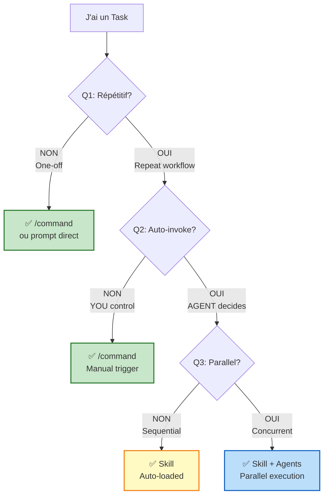

# 🚀 Quick Start: Claude Code en 5 Minutes

> **Point d'entrée pour débutants**. Lisez ceci AVANT tout le reste.
> Temps de lecture : 5 minutes | Niveau : Débutant

---

## 📚 Qu'est-ce que Claude Code?

**Claude Code** = CLI AI qui transforme votre terminal en IDE intelligent avec Claude.

**3 concepts clés à retenir** :

```
┌─────────────────────────────────────────────────┐
│  Commands  → Workflows que VOUS lancez (manual) │
│  Skills    → Knowledge que AGENT charge (auto)  │
│  Agents    → Tasks parallèles (concurrent)      │
└─────────────────────────────────────────────────┘
```

---

## 🎯 Decision Tree : Quelle Feature Utiliser?

**Posez-vous ces 3 questions dans l'ordre** :



**Exemples concrets** :
- Task one-off "Fix cette typo" → prompt direct ✅
- Workflow répété "Code review" → `/code-review` command ✅
- Knowledge auto "Security best practices" → Skill ✅
- 50 files à traiter → Command + Agents ✅

---

## ⚡ Top 3 Features Essentielles

### 1️⃣ Commands (👤 Manual Trigger)

**C'est quoi** : Workflows que VOUS lancez explicitement.

**Fichier** : `.claude/commands/command-name.md`

**Usage** :
```bash
/code-review
/deploy
/generate-docs
```

**Quand utiliser** :
- ✅ Workflow répétitif que VOUS contrôlez
- ✅ Orchestration (lance agents, agrège résultats)
- ✅ THE PRIMITIVE (base de tout)

### 2️⃣ Skills (🤖 Auto Trigger)

**C'est quoi** : Knowledge que l'AGENT charge automatiquement selon le contexte.

**Fichier** : `.claude/skills/skill-name/SKILL.md`

**Dual Role** :
- 📚 **Knowledge Base** : Domain context (comme CLAUDE.md étendu)
- 🏗️ **Composition Layer** : Orchestre commands/MCP/agents

**Quand utiliser** :
- ✅ Knowledge réutilisable (security patterns, standards)
- ✅ Want auto-invoke (agent décide WHEN)
- ✅ Shared across multiple commands/agents

### 3️⃣ Agents (⚡ Parallel Execution)

**C'est quoi** : Tasks qui s'exécutent en parallèle, lancées par un Command.

**Pattern** :
```
Command (orchestrator)
  ↓
Launch 10 agents en parallèle
  ↓
Agents exécutent (isolated contexts)
  ↓
Command agrège résultats
```

**Quand utiliser** :
- ✅ Tasks indépendantes (pas de shared state)
- ✅ Parallélisables (10 files → 10 agents)
- ✅ Isolation context (évite context pollution)

---

## 🏁 Premier Workflow en 3 Minutes

### Étape 1 : Setup Basique (30 sec)

Créez votre config personnelle :

```bash
# Créer le dossier
mkdir -p .claude

# Créer votre mémoire (préférences)
touch .claude/CLAUDE.md
```

Ajoutez vos préférences dans `.claude/CLAUDE.md` :

```markdown
# Mémoire du Projet

## Style de Code
- Indentation : 2 espaces
- Quotes : Single quotes
- Format commits : conventional commits

## Stack Technique
- Framework : Next.js 14
- Database : Supabase
- Styling : Tailwind CSS
```

### Étape 2 : Créer Votre Premier Command (1 min)

Créez `.claude/commands/hello.md` :

```markdown
---
description: Say hello to test Claude Code
allowed-tools: Bash
---

You are a friendly greeter. Say hello to the user and show the current date.

Use Bash tool to get the date:
```bash
date
```

Then greet the user with a friendly message.
```

### Étape 3 : Tester (30 sec)

Dans Claude Code, lancez :

```bash
/hello
```

**✅ Bravo ! Vous venez de créer votre premier command !**

---

## 🎓 Concepts Clés à Retenir

### Golden Rule (Dan's Philosophy)

> **"Prompt = Primitive. Everything else is composition."**

**Workflow recommandé** :

```
1. Problem
   ↓
2. Write /command (THE PRIMITIVE)
   ↓
3. Test & Validate
   ↓
4. Works? → Repeat workflow?
   ↓
5. IF repeat + auto-invoke needed → Compose to Skill
   ↓
6. IF parallel execution needed → Add Agents
```

**❌ JAMAIS** : Commencer direct par Skill + Agents (sur-ingénierie)

**✅ TOUJOURS** : Command d'abord → Valider → Composer IF needed

### Manual vs Auto Trigger

| Trigger | Feature | Example | Use Case |
|---------|---------|---------|----------|
| 👤 **Manual** | Command | `/code-review` | YOU control WHEN |
| 🤖 **Auto** | Skill | `@security-patterns` | AGENT decides WHEN |
| 🔀 **Both** | Agent | `@fix-grammar` | Launched by command OR auto |

### Progressive Disclosure (Skills vs MCP)

**Skills** (✅ Efficient) :
- Level 1 : Metadata (~100 tokens)
- Level 2 : SKILL.md (~2K tokens)
- Level 3 : Resources (~5K tokens)

**MCP** (⚠️ Explosion) :
- All context upfront (~50K+ tokens)
- Risk : Context limit hit

**Leçon** : Use Skills for knowledge, MCP for external data (APIs, DBs)

---

## 📖 Où Aller Ensuite?

### 🎯 Pour Comprendre le Framework

📚 **[Core 4 & Fundamentals](themes/8-advanced/core-4-fundamentals.md)** (30 min)
- Framework Dan complet
- Tableau comparatif
- Hiérarchie composition
- Progressive Disclosure
- **THE REFERENCE** pour comprendre la philosophie

### 🧭 Pour Choisir la Bonne Feature

🎯 **[Decision Trees](themes/8-advanced/decision-trees.md)** (20 min)
- Framework 3 questions (Q1, Q2, Q3)
- Decision trees détaillés par feature
- Scenarios réels
- Anti-patterns

### 📚 Pour Apprendre les Features

| Feature | Guide | Temps | Niveau |
|---------|-------|-------|--------|
| **Memory** | [Memory Guide](themes/1-memory/guide.md) | 15 min | 🟢 Débutant |
| **Commands** | [Commands Guide](themes/2-commands/guide.md) | 30 min | 🟢 Débutant |
| **Hooks** | [Hooks Guide](themes/3-hooks/guide.md) | 20 min | 🟡 Intermédiaire |
| **Skills** | [Skills Guide](themes/4-skills/guide.md) | 40 min | 🟡 Intermédiaire |
| **MCP** | [MCP Guide](themes/5-mcp/guide.md) | 30 min | 🟡 Intermédiaire |
| **Agents** | [Agents Guide](themes/6-agents/guide.md) | 25 min | 🟡 Intermédiaire |
| **Plugins** | [Plugins Guide](themes/7-plugins/guide.md) | 20 min | 🔴 Avancé |

### 🏗️ Pour Créer des Workflows

📋 **[Structure Template](workflow-pattern-orchestration/STRUCTURE-TEMPLATE.md)** (40 min)
- Component Inventory templates
- Mermaid diagram templates
- Implementation examples
- Best practices

🎭 **[Pattern Command/Agent/Skill](workflow-pattern-orchestration/patterns/command-agent-skill.md)** (60 min)
- Orchestration patterns
- Error handling
- Reporting
- Real examples

---

## 🎯 Checklist Débutant

Avant de plonger dans les guides détaillés, assurez-vous de :

- [ ] ✅ Comprendre les 3 concepts (Commands, Skills, Agents)
- [ ] ✅ Savoir utiliser le Decision Tree (Q1, Q2, Q3)
- [ ] ✅ Connaître Golden Rule (Command → Test → Compose IF needed)
- [ ] ✅ Avoir créé votre premier command
- [ ] ✅ Avoir lu ce Quick Start (5 min) ← **VOUS ÊTES ICI !**
- [ ] ⏳ Lire Core 4 & Fundamentals (30 min) ← **PROCHAIN**
- [ ] ⏳ Explorer Decision Trees (20 min)
- [ ] ⏳ Approfondir features individuelles (selon besoin)

---

## 💡 Tips & Astuces

### DO ✅

1. **Start simple** : Commencez par Commands (pas Skills direct)
2. **Test first** : Toujours valider avant de complexifier
3. **Use Memory** : DRY (Don't Repeat Yourself) vos préférences
4. **Read Core 4** : Comprendre POURQUOI avant COMMENT
5. **Follow Golden Rule** : Command → Validate → Compose IF needed

### DON'T ❌

1. **Sur-ingénierie** : Pas de Skill + Agents direct sans tester Command d'abord
2. **MCP seul** : Toujours combiner avec Skills (progressive disclosure)
3. **Skip validation** : Test & Validate AVANT composition
4. **Ignorer framework** : Dan's philosophy = la base de tout
5. **Complexifier inutilement** : Simple > Complex

---

## 🚀 Prêt à Continuer?

**Félicitations !** Vous avez maintenant les bases pour être productif avec Claude Code.

**Prochain step recommandé** :

📚 **[Core 4 & Fundamentals](themes/8-advanced/core-4-fundamentals.md)** (30 min)
- Comprendre le framework Dan en profondeur
- Bases solides pour tous les autres guides
- THE REFERENCE à lire absolument

**Bon apprentissage ! 🎉**
