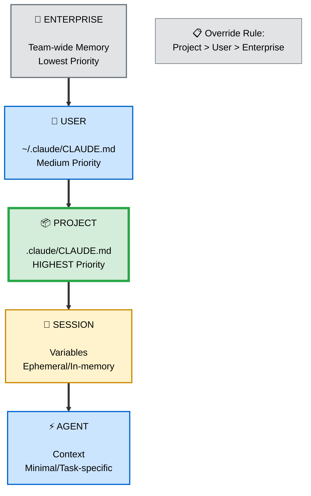
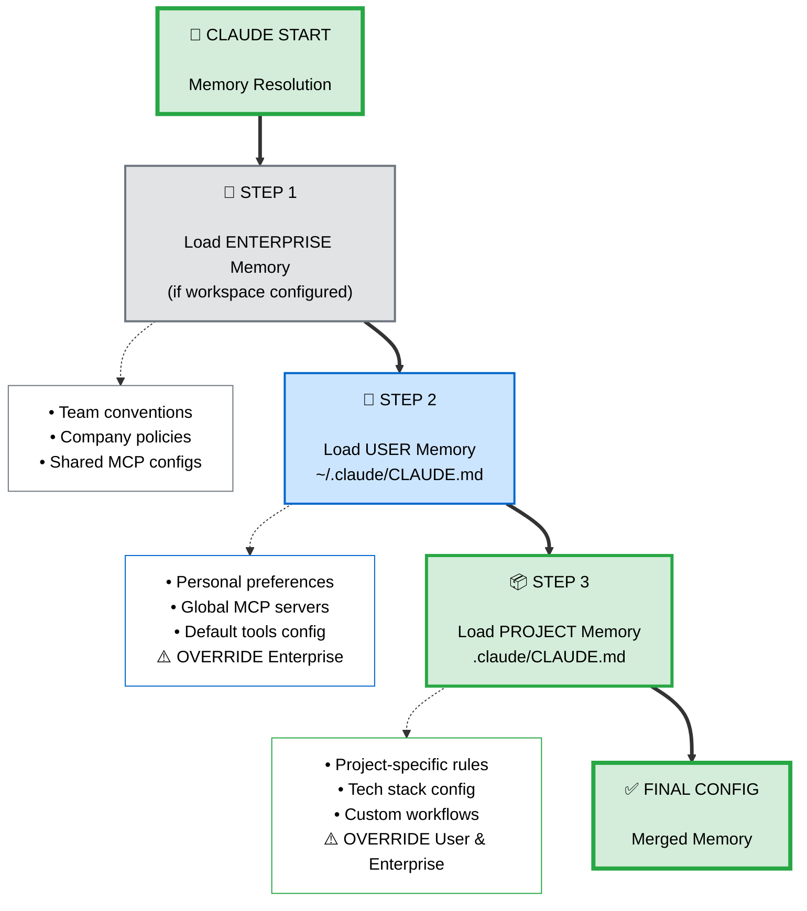
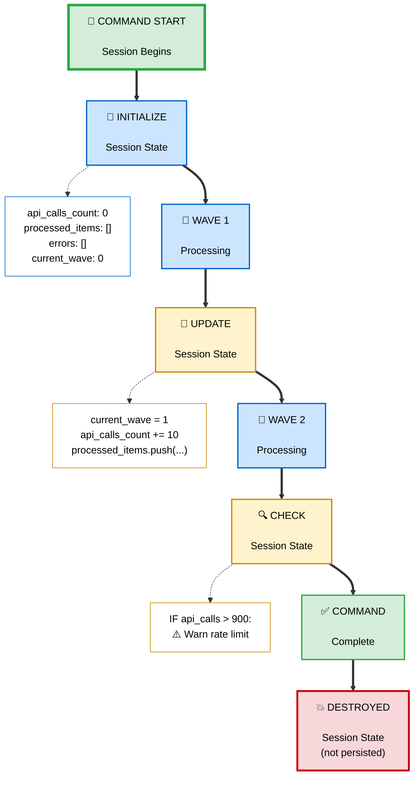
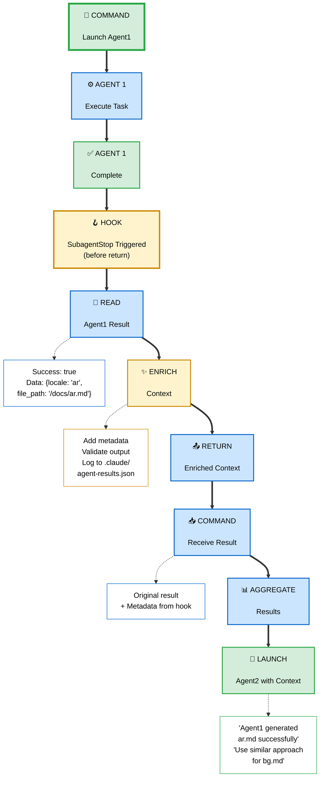

# Patterns: State Management & Persistence

**Status**: ✅ VALIDATED - Best practices from Claude Code + distributed state patterns
**Date**: 2025-01-17
**Sources**:
- Claude Code official docs: Memory, hooks, context window
- SubagentStop hook pattern (Edmund Yong setup)
- Long-running workflow patterns (NetworkChuck, Solo Swift Crafter)

---

## 📐 Core Pattern: Hierarchical Memory



**Principes clés**:
- **Hierarchie stricte**: Project > User > Enterprise (override)
- **Persistence levels**: Permanent (Memory) vs Ephemeral (Session)
- **Context flow**: Command → Agent via hooks (SubagentStop)
- **Recovery**: Checkpoints pour long workflows

---

## 1️⃣ Memory Hierarchy Pattern

### Concept

Organiser les **préférences et conventions** sur 3 niveaux avec **override** : Project (priorité max) > User > Enterprise.

### Flow Hiérarchique



### Exemple Concret: Code Style Preferences

**Scenario**: Team enforce 4 spaces, User préfère 2, Project override à tabs.

```markdown
# 🏢 ENTERPRISE Memory (lowest priority)
# ~/enterprise/.claude/CLAUDE.md

## Code Style
- Indentation: 4 spaces (company standard)
- Line length: 120 chars
- Quotes: Double quotes
```

```markdown
# 👤 USER Memory (medium priority)
# ~/.claude/CLAUDE.md

## Code Style
- Indentation: 2 spaces (override: je préfère 2)
- Line length: 100 chars (override: plus lisible)
# Quotes: inherited from enterprise (double)
```

```markdown
# 📦 PROJECT Memory (highest priority)
# /project/.claude/CLAUDE.md

## Code Style
- Indentation: tabs (override: legacy codebase uses tabs)
# Line length: inherited from user (100)
# Quotes: inherited from enterprise (double)
```

**Résolution finale pour ce projet**:
- Indentation: **tabs** (project override)
- Line length: **100 chars** (user override)
- Quotes: **double** (enterprise, no override)

### Import Syntax

```markdown
# .claude/CLAUDE.md

## Project Memory

This project uses TypeScript strict mode.

## Inherited Conventions

Import user preferences for commit messages:
<!-- import: ~/.claude/CLAUDE.md#commit-conventions -->

Import enterprise MCP configs:
<!-- import: ~/enterprise/.claude/CLAUDE.md#mcp-servers -->
```

**Avantage**: DRY (Don't Repeat Yourself) - définir une fois, réutiliser partout.

---

## 2️⃣ Session Variables Pattern

### Concept

Variables **éphémères** (non persistées) pour stocker état temporaire pendant workflow. Disparaissent après session.

### Flow de Session State



### Exemple: Batch Processing State

```yaml
# .claude/commands/generate-locales.md

## Workflow

1. **INITIALIZE SESSION STATE**
   ```javascript
   const sessionState = {
     totalLocales: 50,
     processedLocales: [],
     failedLocales: [],
     currentWave: 0,
     apiCallsUsed: 0,
     startTime: Date.now()
   };
   ```

2. **PROCESS WAVES**
   ```javascript
   for (const batch of batches) {
     sessionState.currentWave++;

     // Check state before wave
     if (sessionState.apiCallsUsed > API_LIMIT * 0.9) {
       console.log("Near rate limit, pausing...");
       break;
     }

     // Launch agents...
     const results = await launchParallelAgents(batch);

     // Update state after wave
     sessionState.processedLocales.push(...results.success);
     sessionState.failedLocales.push(...results.failed);
     sessionState.apiCallsUsed += batch.length;

     // Log progress
     console.log(`Wave ${sessionState.currentWave}: ${results.success.length}/${batch.length} success`);
   }
   ```

3. **FINAL REPORT using Session State**
   ```javascript
   console.log(`
   Total processed: ${sessionState.processedLocales.length}/${sessionState.totalLocales}
   Failed: ${sessionState.failedLocales.length}
   API calls used: ${sessionState.apiCallsUsed}
   Duration: ${(Date.now() - sessionState.startTime) / 1000}s
   `);
   ```
```

### Session vs Persistent State

| Aspect | Session Variables | Memory (CLAUDE.md) |
|--------|------------------|-------------------|
| **Lifetime** | Single command execution | Permanent (until edited) |
| **Storage** | In-memory | Disk (.claude/CLAUDE.md) |
| **Use Case** | Temporary counters, progress | Preferences, conventions |
| **Scope** | Current command | All commands |
| **Example** | `api_calls_count`, `current_wave` | `indent_style`, `commit_format` |

---

## 3️⃣ Cross-Agent Communication (Hooks)

### Concept

Passer **contexte et état** entre COMMAND et AGENTS via **hooks** (notamment `SubagentStop`).

### Flow avec SubagentStop Hook



### Exemple: SubagentStop Hook

```yaml
# .claude/hooks/subagent-stop.md
---
description: Enrich agent results and pass context to next agents
event: SubagentStop
---

You are a cross-agent communication coordinator.

## Workflow

1. **READ AGENT RESULT**
   - Access: `agentResult` object from context
   - Extract: status, data, errors

2. **VALIDATE OUTPUT**
   ```
   IF agentResult.status === 'success':
     - Verify required fields present
     - Check data integrity
   ELSE:
     - Log error to .claude/agent-errors.log
     - Prepare retry context
   ```

3. **ENRICH METADATA**
   ```javascript
   const enrichedResult = {
     ...agentResult,
     metadata: {
       agent_name: '@generate-locale',
       completed_at: new Date().toISOString(),
       duration_ms: agentDuration,
       source: agentResult.data.source || 'unknown'
     }
   };
   ```

4. **PERSIST TO SHARED STATE** (optional)
   ```
   Append to .claude/agent-results.json:
   {
     "agent_id": "agent-123",
     "task": "generate ar.md",
     "result": enrichedResult,
     "timestamp": "2025-01-17T10:30:00Z"
   }
   ```

5. **PASS CONTEXT TO NEXT AGENT**
   ```
   Set context variable:
   - previous_agent_success = true
   - previous_agent_source = 'context7'
   - previous_agent_duration = 12000ms

   Next agent can read this context and adapt:
   - "Previous agent used context7 successfully, use same source"
   ```

6. **RETURN ENRICHED RESULT**
   - Command receives original result + metadata
```

### Use Cases Cross-Agent Communication

| Use Case | Hook | What to Pass |
|----------|------|--------------|
| **Learning from prev agent** | SubagentStop | Success/failure, source used, approach |
| **Sharing discovered data** | SubagentStop | API endpoints, auth tokens, config |
| **Error patterns** | SubagentStop | Common errors, workarounds |
| **Performance hints** | SubagentStop | Slow endpoints, cache hits |

---

## 4️⃣ Checkpoints & Recovery

### Concept

Pour **long workflows** (>5 min), sauvegarder état intermédiaire pour **recovery** en cas de crash/timeout.

### Flow avec Checkpoints

```mermaid
flowchart TD
    Start["🎯 COMMAND START<br/><br/>50 Locales to Generate"]

    Check["🔍 CHECK<br/><br/>Checkpoint Exists?<br/>.claude/checkpoint.json"]

    Exists{Checkpoint<br/>Exists?}

    Resume["♻️ RESUME<br/><br/>From Checkpoint<br/>Skip completed items"]

    Fresh["🆕 START<br/><br/>From Beginning"]

    Wave1["🌊 WAVE 1<br/><br/>Complete (10 locales)"]

    Save["💾 SAVE<br/><br/>Checkpoint"]
    SaveData["command: 'generate-locales'<br/>total: 50<br/>completed: ['ar', 'bg'...]<br/>current_wave: 1"]

    Wave2["🌊 WAVE 2<br/><br/>Complete (10 locales)"]

    Update["💾 UPDATE<br/><br/>Checkpoint<br/>completed: 20"]

    Crash["💥 CRASH<br/><br/>Timeout/Error"]

    Rerun["🔄 RERUN<br/><br/>User Re-run Command"]

    Load["📂 LOAD<br/><br/>Checkpoint<br/>Found: 20/50 completed"]

    Ask["❓ ASK USER<br/><br/>'Resume or Restart?'"]

    Decision{User<br/>Choice}

    Wave3["🌊 WAVE 3<br/><br/>Resume (30 remaining)"]

    Complete["✅ COMPLETE<br/><br/>Workflow Done"]

    Delete["🗑️ DELETE<br/><br/>Checkpoint (success)"]

    Start ==> Check
    Check ==> Exists
    Exists -->|YES| Resume
    Exists -->|NO| Fresh
    Fresh ==> Wave1
    Wave1 ==> Save
    Save -.-> SaveData
    Save ==> Wave2
    Wave2 ==> Update
    Update ==> Crash
    Crash ==> Rerun
    Rerun ==> Load
    Load ==> Ask
    Ask ==> Decision
    Decision -->|Resume| Wave3
    Decision -->|Restart| Fresh
    Wave3 ==> Complete
    Complete ==> Delete

    style Start fill:#d4edda,stroke:#28a745,stroke-width:4px,color:#000
    style Check fill:#cce5ff,stroke:#0066cc,stroke-width:2px,color:#000
    style Exists fill:#fff3cd,stroke:#cc8800,stroke-width:3px,color:#000
    style Resume fill:#cce5ff,stroke:#0066cc,stroke-width:2px,color:#000
    style Fresh fill:#cce5ff,stroke:#0066cc,stroke-width:2px,color:#000
    style Wave1 fill:#cce5ff,stroke:#0066cc,stroke-width:2px,color:#000
    style Save fill:#fff3cd,stroke:#cc8800,stroke-width:2px,color:#000
    style SaveData fill:#ffffff,stroke:#cc8800,stroke-width:1px,color:#000
    style Wave2 fill:#cce5ff,stroke:#0066cc,stroke-width:2px,color:#000
    style Update fill:#fff3cd,stroke:#cc8800,stroke-width:2px,color:#000
    style Crash fill:#f8d7da,stroke:#cc0000,stroke-width:3px,color:#000
    style Rerun fill:#cce5ff,stroke:#0066cc,stroke-width:2px,color:#000
    style Load fill:#cce5ff,stroke:#0066cc,stroke-width:2px,color:#000
    style Ask fill:#fff3cd,stroke:#cc8800,stroke-width:2px,color:#000
    style Decision fill:#fff3cd,stroke:#cc8800,stroke-width:3px,color:#000
    style Wave3 fill:#cce5ff,stroke:#0066cc,stroke-width:2px,color:#000
    style Complete fill:#d4edda,stroke:#28a745,stroke-width:2px,color:#000
    style Delete fill:#d4edda,stroke:#28a745,stroke-width:4px,color:#000
```



### Exemple: Checkpoint Implementation

```yaml
# .claude/commands/generate-locales.md

## Workflow

1. **CHECK FOR CHECKPOINT**
   ```javascript
   const checkpointPath = '.claude/checkpoint-generate-locales.json';
   let checkpoint = null;

   if (fileExists(checkpointPath)) {
     checkpoint = JSON.parse(readFile(checkpointPath));

     const response = await AskUserQuestion({
       questions: [{
         question: `Found checkpoint: ${checkpoint.completed.length}/${checkpoint.total} locales done. Resume?`,
         header: "Resume",
         options: [
           { label: "Resume", description: "Continue from where left off" },
           { label: "Restart", description: "Start fresh, delete checkpoint" }
         ],
         multiSelect: false
       }]
     });

     if (response.Resume === "Restart") {
       deleteFile(checkpointPath);
       checkpoint = null;
     }
   }
   ```

2. **FILTER LOCALES** (if resuming)
   ```javascript
   let localesToProcess = allLocales;

   if (checkpoint) {
     // Skip already completed locales
     localesToProcess = allLocales.filter(
       locale => !checkpoint.completed.includes(locale)
     );
     console.log(`Resuming: ${localesToProcess.length} locales remaining`);
   }
   ```

3. **SAVE CHECKPOINT** (after each wave)
   ```javascript
   function saveCheckpoint(wave, completed, failed) {
     const checkpoint = {
       command: 'generate-locales',
       total: allLocales.length,
       completed: completed,
       failed: failed,
       current_wave: wave,
       timestamp: new Date().toISOString()
     };

     writeFile(checkpointPath, JSON.stringify(checkpoint, null, 2));
     console.log(`✅ Checkpoint saved: ${completed.length}/${checkpoint.total}`);
   }

   // After each wave
   saveCheckpoint(waveNumber, allCompletedLocales, allFailedLocales);
   ```

4. **DELETE CHECKPOINT** (on success)
   ```javascript
   // After workflow completes successfully
   if (fileExists(checkpointPath)) {
     deleteFile(checkpointPath);
     console.log("Checkpoint deleted (workflow completed)");
   }
   ```
```

### Checkpoint Guidelines

| Workflow Duration | Checkpoint Frequency | Notes |
|------------------|---------------------|-------|
| **< 1 min** | ❌ No checkpoint | Overhead inutile |
| **1-5 min** | After each batch | Optional mais recommandé |
| **> 5 min** | ✅ After each batch | **Mandatory** (crash risk) |
| **> 15 min** | After each item | Granular recovery |

---

## 5️⃣ Context Window Management

### Concept

Gérer **token limit** (200k tokens) en **compactant contexte** entre operations longues.

### Flow de Context Compaction

```
╔════════════════════════════════════════════╗
║       Context Window Management            ║
╚════════════════════════════════════════════╝

COMMAND démarre
    ↓
Context: 20k tokens
    ↓
WAVE 1 processing
    ↓
Context: 45k tokens (added agent results)
    ↓
WAVE 2 processing
    ↓
Context: 78k tokens
    ↓
[Context > 50k?] ────YES───→ COMPACT CONTEXT
    │                         ↓
    NO                   ┌────────────────────┐
    ↓                    │ Summarize results: │
WAVE 3...                │ - Wave 1: 10/10 ✅  │
                         │ - Wave 2: 9/10 ⚠️  │
                         │ Drop verbose logs  │
                         │ Keep only errors   │
                         └────────────────────┘
                              ↓
                         Context: 35k tokens
                              ↓
                         Continue processing
```

### Exemple: Context Compaction

```yaml
# .claude/commands/generate-locales.md

## Context Management

4. **COMPACT CONTEXT** (after each wave if needed)
   ```javascript
   function compactContext(waveResults, allResults) {
     // Estimate current context size
     const estimatedTokens = estimateTokens(allResults);

     if (estimatedTokens > 50000) {
       console.log("⚠️ Context exceeding 50k tokens, compacting...");

       // Summarize verbose data
       const compactResults = allResults.map(result => {
         if (result.status === 'success') {
           // Keep only essential info for successes
           return {
             locale: result.locale,
             status: 'success',
             // Drop: full file content, verbose logs
           };
         } else {
           // Keep full details for failures (debugging)
           return result;
         }
       });

       // Update context
       allResults = compactResults;

       console.log(`✅ Context compacted: ~${estimateTokens(compactResults)}k tokens`);
     }

     return allResults;
   }

   // Usage after each wave
   allResults = compactContext(waveResults, allResults);
   ```

### Token Estimation (approximation)

```javascript
function estimateTokens(data) {
  // Rough estimate: 1 token ≈ 4 chars
  const jsonString = JSON.stringify(data);
  return Math.ceil(jsonString.length / 4);
}
```

### Context Compaction Strategies

| Strategy | When | What to Keep | What to Drop |
|----------|------|--------------|--------------|
| **Summarize successes** | >50k tokens | Status, key metrics | Full content, logs |
| **Keep failures** | Always | Full error details | Nothing (debug needed) |
| **Drop intermediate** | >100k tokens | First & last wave | Middle waves (if not critical) |
| **Aggregate metrics** | >150k tokens | Summary stats only | Individual results |

---

## 🎯 Best Practices

### ✅ DO

1. **Memory hierarchy**: Project > User > Enterprise (override)
2. **Session variables** pour état temporaire (counters, progress)
3. **SubagentStop hooks** pour cross-agent communication
4. **Checkpoints** pour workflows >5 min
5. **Compact context** quand >50k tokens
6. **Persist critical data** (errors, failures) to disk
7. **Use imports** dans Memory pour DRY

### ❌ DON'T

1. **Mix session et persistent state** (clarté)
2. **Store secrets** dans Memory (use env vars)
3. **Ignore context window** (monitoring required)
4. **Over-checkpoint** (<1 min workflows)
5. **Shared state entre agents** (isolation)
6. **Keep verbose logs** in context (compact)

---

## 📋 Cheatsheet Rapide

```bash
# Memory Hierarchy (Priority)
Project (.claude/CLAUDE.md)     # Highest
  ↓ override
User (~/.claude/CLAUDE.md)      # Medium
  ↓ override
Enterprise (workspace)          # Lowest

# Import Syntax
<!-- import: ~/.claude/CLAUDE.md#section -->

# Session Variables (in-memory)
const sessionState = {
  count: 0,
  processed: [],
  errors: []
};

# Cross-Agent Communication (hook)
# .claude/hooks/subagent-stop.md
- Read: agentResult
- Enrich: metadata
- Pass: context to next agent

# Checkpoints (long workflows)
IF workflow_duration > 5min:
  saveCheckpoint(wave, completed, failed)
IF crash:
  loadCheckpoint() → resume

# Context Compaction
IF context > 50k tokens:
  summarize successes (keep failures)
  drop verbose logs
```

---

## 🎓 Points Clés

1. **Hierarchie mémoire** : Project override User override Enterprise
2. **Session vs Persistent** : Éphémère (variables) vs Permanent (Memory)
3. **SubagentStop hook** : Communication entre agents (pass context)
4. **Checkpoints critiques** : Workflows >5 min (recovery)
5. **Context window** : Monitorer et compacter >50k tokens
6. **DRY avec imports** : Réutiliser configs (Memory imports)
7. **Persist errors** : Toujours sauver échecs sur disk (debug)

---

## 📚 Ressources

### Documentation Interne
- 📄 [Memory Guide](../../themes/1-memory/guide.md) - CLAUDE.md configuration
- 📄 [Hooks Guide](../../themes/6-hooks/guide.md) - SubagentStop automation
- 📄 [Command/Agent Pattern](./command-agent-skill.md) - Orchestration base
- 📄 [Error Handling](./error-handling.md) - Checkpoints & recovery
- 📄 [Parallel Execution](./parallel-execution.md) - Session state in batches

### Documentation Externe
- 📄 [Claude Code Memory](https://code.claude.com/docs/memory) - Hierarchy official docs
- 📄 [Context Window](https://www.anthropic.com/news/claude-3-5-sonnet) - 200k token limit
- 📄 [SubagentStop Hook](https://code.claude.com/docs/hooks#subagent-stop) - Cross-agent communication

### Repos Communauté
- 🔗 [Edmund Yong Setup](https://github.com/edmund-io/edmunds-claude-code) - SubagentStop examples
- 🔗 [Weston Hobson Commands](https://github.com/wshobson/commands) - Session state patterns
- 🔗 [Long Workflows](https://github.com/VoltAgent/awesome-claude-code-subagents) - Checkpoint strategies
