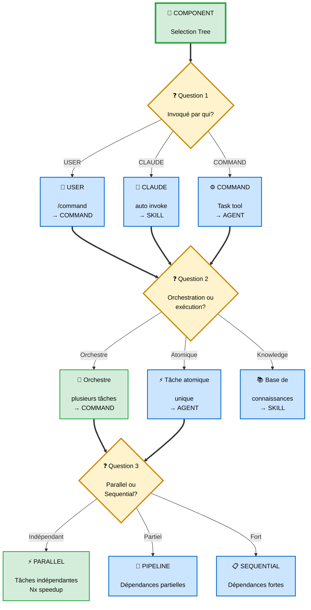

# Guide de Référence Rapide - Orchestration Claude Code

> **Quick access** aux patterns, syntaxes et best practices d'orchestration avec Claude Code

---

## ⚠️ **Note Rapide**

**Terminologie officielle** :
- Subagents (`.claude/agents/*.md`)
- Custom slash commands (`.claude/commands/*.md`)
- Skills (`.claude/skills/*/SKILL.md`)
- Hooks (`settings.json`, bash ou LLM)

**Ce guide** utilise "COMMAND", "AGENT/SUBAGENT" comme conventions. Voir [nomenclature.md](./1-fundamentals/nomenclature.md) pour détails.

## 🎯 Decision Tree : Quel composant utiliser ?



---

## 📦 COMMANDS - Syntaxe Complète

### Structure Command Basique

```markdown
# .claude/commands/my-command.md

---
name: my-command
description: Brief description for /help listing
---

You will orchestrate [task description].

## Process

1. [Step 1 description]
2. Launch agents IN PARALLEL using Task tool:
   - Call Task tool ONCE with ALL agents
   - Maximum 20 agents per batch
3. Aggregate results
4. Validate outputs
5. Generate report

## Error Handling

- If agent fails → Retry once
- If retry fails → Log error, continue
- Success threshold: 95%

## Output Format

```json
{
  "status": "success",
  "results": [...],
  "errors": [...]
}
\```
\```

### Parallel Execution Pattern (CRITICAL)

```markdown
## CRITICAL: Parallel Execution

To execute agents in parallel, you MUST:
- Send a SINGLE message with MULTIPLE Task tool calls
- Do NOT use sequential messages
- Do NOT wait for one agent before launching next

Example:
```typescript
// ✅ CORRECT: Parallel
[
  Task({ subagent_type: "agent1", prompt: "..." }),
  Task({ subagent_type: "agent2", prompt: "..." }),
  Task({ subagent_type: "agent3", prompt: "..." })
]

// ❌ WRONG: Sequential
Task({ subagent_type: "agent1" })
// wait...
Task({ subagent_type: "agent2" })
\```
\```

---

## 🧠 SKILLS - Syntaxe Complète

### Structure Skill avec Frontmatter

```markdown
# .claude/skills/skill-name/SKILL.md

---
# Required
name: skill-name
description: Extract text from PDFs, fill forms. Use when working with PDFs or documents.

# Optional: Usage guidance
when_to_use: When user mentions PDFs, forms, or document extraction

# Optional: Pre-approved tools (no user prompt)
allowed-tools: Read, Write, Bash(pdftotext:*), Bash(python {baseDir}/scripts/*:*)

# Optional: Model selection
model: haiku      # Fast & cheap (4x faster, 10x cheaper than sonnet)
# model: sonnet   # Balanced (default)
# model: opus     # Powerful (complex reasoning)

# Optional: Version tracking
version: 1.0.0

# Optional: Disable auto-invocation
disable-model-invocation: false
---

[Full skill instructions: 500-5000 words]

## Process

1. Validate input
2. Use bundled resources: {baseDir}/scripts/extract.py
3. Handle errors with fallbacks
4. Return structured output

## Error Handling

- Try primary tool (pdftotext)
- Fallback 1: Alternative tool (pdf2text)
- Fallback 2: Manual extraction
- Log error + continue with best effort
\```

### Bundled Resources Structure

```
.claude/skills/skill-name/
├── SKILL.md                   # Main prompt
├── scripts/                   # Executables
│   ├── helper.py
│   └── requirements.txt
├── references/                # Documentation
│   └── api_docs.md
└── assets/                    # Static files
    └── template.json
```

### Skills Performance Benefits

```
┌─────────────────────────────────────────────────────────┐
│         SKILLS PERFORMANCE OPTIMIZATION                 │
├─────────────────────────────────────────────────────────┤
│                                                         │
│  Progressive Disclosure:                               │
│    ├─> Frontmatter: 50 tokens (always loaded)         │
│    ├─> Full prompt: 6,500 tokens (on-demand)          │
│    └─> Savings: 89% context reduction                 │
│                                                         │
│  Pre-Approved Tools:                                   │
│    ├─> 0 user prompts (instant execution)             │
│    └─> 100% time saved on approvals                   │
│                                                         │
│  Model Selection:                                      │
│    ├─> haiku: 4x faster, 10x cheaper                  │
│    ├─> sonnet: balanced                               │
│    └─> opus: powerful                                 │
│                                                         │
│  Bundled Resources:                                    │
│    ├─> 0 network calls                                │
│    ├─> <1s setup                                      │
│    └─> 100% reliability                               │
│                                                         │
└─────────────────────────────────────────────────────────┘
```

---

## 🤖 AGENTS - Syntaxe Complète

### Structure Agent Minimal

```markdown
# .claude/agents/agent-name.md

---
subagent_type: agent-name
description: Performs specific atomic task (e.g., analyzes legal risks)
model: sonnet  # Optional: haiku/sonnet/opus
---

You will perform [specific atomic task].

## Input Expected

- Parameter 1: {description}
- Parameter 2: {description}

## Process

1. Validate input
2. Execute task (NO orchestration, NO sub-agents)
3. Return structured result

## Output Format

```json
{
  "task": "agent-name",
  "status": "success|failed",
  "result": {...},
  "confidence": 0.95,
  "errors": []
}
\```

## Error Handling

- If error → Return failed status with error details
- Do NOT retry (Command handles retries)
- Log error clearly
\```

### Agent Rules (CRITICAL)

```
✅ DO:
  ├─> Execute ONE atomic task
  ├─> Return structured result
  ├─> Handle errors gracefully
  └─> Use Skills for shared knowledge

❌ DON'T:
  ├─> Launch other agents (violation!)
  ├─> Orchestrate multiple tasks (use Command)
  ├─> Make strategic decisions (Command's job)
  └─> Repeat knowledge (use Skills)
```

---

## ⚡ Performance Patterns

### Pattern 1: Parallelization

```yaml
Use Case: Translation 20 languages
Strategy: Launch 20 agents in parallel

Baseline (Sequential):
  20 languages × 5min = 100min

Optimized (Parallel):
  Wave 1: 20 agents → 5min (longest)
  Speedup: 20x

Code Pattern:
  # In Command:
  Launch all 20 agents in SINGLE message (parallel)
  Maximum 20 agents/wave (API limits)
  Wait for all completions
  Aggregate results
```

### Pattern 2: Batching

```yaml
Use Case: Process 1,000 items
Strategy: Batch into groups

Optimal Batch Sizes:
  - Small items (50 tokens): 50/batch
  - Medium items (500 tokens): 20/batch
  - Large items (2000 tokens): 10/batch
  - Very large (5000 tokens): 3/batch

Example:
  1,000 strings × 50 tokens
  Batch size: 20
  Batches: 50
  Speedup: 14x vs individual processing
```

### Pattern 3: Wave Execution

```yaml
Use Case: 100 parallel agents (rate limit risk)
Strategy: Launch in waves

Without Waves:
  Launch all 100 → rate limit → 45min (retries)

With Waves (20/wave):
  Wave 1-5: 3min each = 15min total
  Speedup: 3x
  Success rate: 98% vs 85%

Implementation:
  for i in range(0, 100, 20):
    wave = agents[i:i+20]
    launch_parallel(wave)
    wait_for_completion()
```

### Pattern 4: Caching

```yaml
Multi-Level Cache Hierarchy:

L1 (In-Memory): 0ms latency, 5min TTL
L2 (File): <10ms latency, 24h TTL
L3 (Skill): Knowledge base (persistent)
L4 (Database): 50-100ms, 30d TTL
L5 (Compute): Full API call (1-10s)

Hit Rate Optimization:
  Week 1: 10% (cold)
  Month 1: 50% (warm)
  Month 6: 80% (hot)
  Speedup: 4.4x at maturity
```

### Pattern 5: Skills for Context Savings

```yaml
Without Skills (Traditional):
  5 agents × 6k words each = 30k words
  Token cost: 39,000 tokens

With Skills (Optimized):
  5 agents × 500 words = 2,500 words
  Skills loaded once: 30k words
  Total: 32,500 words (but loaded once)
  Savings: 30-70% typical

Real Benefit:
  Progressive disclosure: 89% reduction
  Pre-approved tools: 100% time saved
  Model selection: 4-10x cheaper/faster
```

---

## 🎯 Orchestration Rules (CRITICAL)

### Rule 1: Command Orchestrates Always

```
✅ VALID:
  Command → Subagent
  Command → Coordinator Subagent → Worker Subagent

❌ FORBIDDEN (règle officielle):
  Subagent → Subagent
  Subagent → Command
```

**Why**: Auditability, control, clarity

### Rule 2: Flat Hierarchy (3 Levels Max)

```
✅ VALID:
  Level 1: Main Command
    └─> Level 2: Subcommand
          └─> Level 3: Agent (leaf node)

❌ FORBIDDEN:
  Command → Sub → Agent → Subagent (too deep)
```

**Why**: Complexity management, maintainability

### Rule 3: Agents = Atomic Tasks

```
Agent Definition:
  ├─> Executes ONE task
  ├─> Takes NO strategic decisions
  ├─> Launches NO other agents
  └─> Returns simple structured result

Examples:
  ✅ Legal-Analyzer: Analyze document → risks
  ✅ Unit-Tester: Run tests → coverage
  ❌ Pipeline-Manager: Build+Test+Deploy (too broad)
```

---

## 📊 Quick Benchmarks

### Translation Workflow

| Strategy | Time | Cost | Speedup |
|----------|------|------|---------|
| Sequential | 100min | $1.00 | 1x |
| Parallel | 7min | $1.00 | 14x |
| Parallel + Cache | 5min | $0.50 | 20x |

### RFP Workflow

| Strategy | Time | Cost | Speedup |
|----------|------|------|---------|
| Manual | 400h | $0 (labor) | 1x |
| Sequential | 60min | $10 | 400x |
| Parallel + Skills | 11min | $3.50 | 2,180x |

### CI/CD Pipeline

| Strategy | Time | Speedup |
|----------|------|---------|
| Manual | 260min | 1x |
| Sequential | 90min | 2.9x |
| Parallel + Wave | 60min | 4.3x |

---

## 🔧 Common Patterns Reference

### Error Handling Pattern

```yaml
Try/Catch/Fallback:
  TRY: Primary approach
    └─> SUCCESS → Continue
    └─> ERROR → Fallback 1

  FALLBACK 1: Alternative tool
    └─> SUCCESS → Continue
    └─> ERROR → Fallback 2

  FALLBACK 2: Manual/default
    └─> Log error + best effort
```

### Validation Pattern

```yaml
Quality Gates:
  Command
    ├─> Phase 1: Execute agents
    ├─> HOOK: Validation (schema, format)
    ├─> If fail → Block, log error
    ├─> Phase 2: Continue if validated
    └─> HOOK: Final validation
```

### Human-in-Loop Pattern

```yaml
Approval Gates:
  Command
    ├─> Automated processing
    ├─> HOOK: Risk assessment
    │     ├─> Low risk → Continue auto
    │     └─> High risk → Human approval
    │                     ├─> Approved → Continue
    │                     └─> Rejected → Rollback
    └─> Execution
```

---

## 💡 Quick Tips

### Commands

```
✅ Orchestrate, don't execute
✅ Use parallel Task calls (single message)
✅ Set timeouts (5min/agent, 30min/workflow)
✅ Aggregate results progressively
✅ Fail gracefully (95% success threshold)
```

### Skills

```
✅ Keep frontmatter concise (50-200 chars)
✅ Use allowed-tools for pre-approval
✅ Select model: haiku (fast), sonnet (default), opus (complex)
✅ Bundle resources (scripts/, references/, assets/)
✅ Update centrally (DRY principle)
```

### Agents

```
✅ Atomic tasks only (1 agent = 1 task)
✅ Return structured JSON
✅ Use Skills for knowledge
✅ Handle errors, don't retry
✅ No orchestration (Command's job)
```

### Performance

```
✅ Parallelize independent tasks
✅ Batch 10-20 items for optimal throughput
✅ Use waves (20 agents/wave max)
✅ Cache aggressively (multi-level)
✅ Benchmark before/after optimization
```

---

## 📚 Ressources Complètes

**Documentation Détaillée** :
- 📄 [Orchestration Principles](./orchestration-principles.md) - Règles fondamentales
- 📄 [Command/Agent/Skill Patterns]../2-patterns/4-orchestrator-workers.md) - Architecture détaillée
- 📄 [Skill Invocation Lifecycle]../3-architecture/skills-progressive-disclosure.md) - isMeta, 2-message pattern
- 📄 [Performance Optimization](./5-best-practices/performance.md) - Stratégies 1-7

**Articles Externes** :
- 📄 [Claude Skills Deep Dive](https://leehanchung.github.io/blogs/2025/10/26/claude-skills-deep-dive/) - Architecture interne
- 📄 [Official Claude Code Docs](https://code.claude.com/docs) - Documentation officielle

**Workflows Réels** :
- 📄 [Enterprise RFP](./4-workflows/enterprise-rfp.md) - 96x speedup
- 📄 [Global Localization](./4-workflows/global-localization.md) - 15x speedup
- 📄 [CI/CD Pipeline](./4-workflows/ci-cd-pipeline.md) - 6x speedup

---

## 🎓 Points Clés Finaux

### Architecture

```
✅ COMMAND orchestre, AGENT exécute
✅ Hiérarchie recommandée : 2-3 niveaux (4-5 possibles selon complexité)
✅ Agents atomiques (1 task/agent)
✅ Skills pour shared knowledge
```

### Performance

```
✅ Parallel > Sequential (Nx speedup)
✅ Batch 10-20 items (optimal)
✅ Wave execution (prevent saturation)
✅ Multi-level caching (80% hit rate)
```

### Production

```
✅ Hooks pour validation/décisions
✅ Logs JSONL (auditabilité)
✅ Monitoring temps réel
✅ Error handling robuste
```

---

**Ce guide est votre référence rapide - pour détails complets, consultez la documentation complète !**
